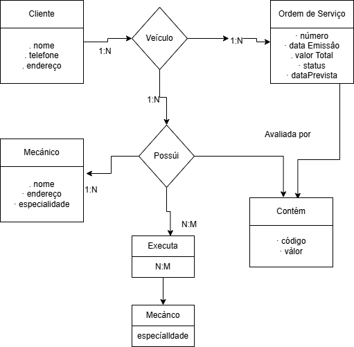

# Modelo Conceitual - Oficina Mecânica

Este projeto apresenta um modelo conceitual de um sistema de controle e gerenciamento de ordens de serviço (OS) em uma oficina mecânica. Ele foi desenvolvido como parte de um desafio prático de modelagem de dados.

## 📌 Objetivo

Criar o esquema conceitual de um sistema de oficina com base na seguinte narrativa:

> Clientes levam veículos à oficina mecânica para consertos ou revisões.  
> Cada veículo é designado a uma equipe de mecânicos que identifica os serviços a serem executados e preenche uma OS com data de entrega.  
> A OS contempla os valores de serviços (com base em uma tabela de mão de obra) e de peças utilizadas.  
> O cliente autoriza a execução dos serviços.  
> A mesma equipe avalia e executa os serviços.

---

## 🧩 Entidades e Relacionamentos

- **Cliente**: nome, telefone, endereço  
- **Veículo**: pertence a um cliente  
- **Ordem de Serviço**: número, data de emissão, valor total, status, data prevista  
- **Mecânico**: código, nome, endereço, especialidade  
- **Serviços Executados**: associados a uma OS  
- **Peças**: código, valor — associadas às OS via relacionamento `Contém`

---

## 📎 Arquivos incluídos

- `modelo-conceitual-oficina.drawio`: arquivo editável do diagrama
- `modelo-conceitual-oficina.drawio.png`: imagem do diagrama para visualização rápida

---

## 📷 Diagrama

---

## ✍️ Observações

Caso algum ponto da narrativa não tenha sido totalmente definido, foi utilizado bom senso para modelar a estrutura mais fiel ao cenário de uma oficina.

---

## 👨‍💻 Autor

[Thiago1326](https://github.com/Thiago1326)
